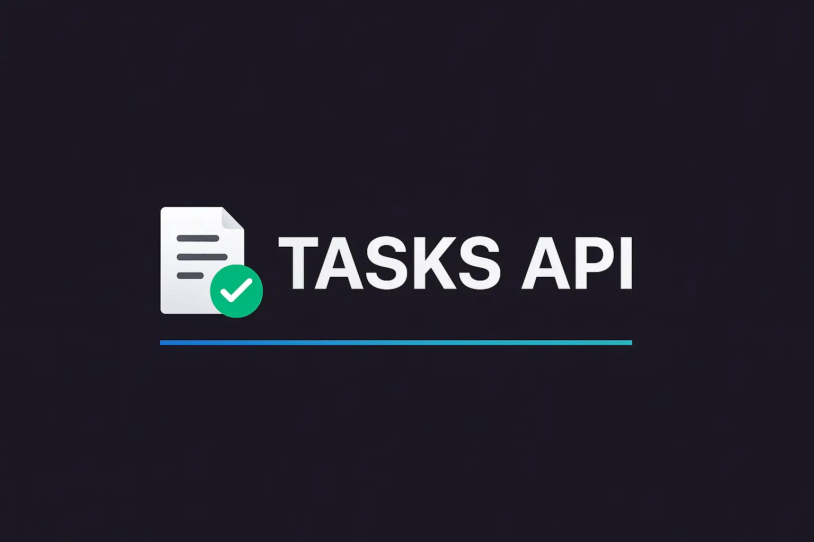

# 📝 Tasks API — Gerenciador Simples de Tarefas via Node.js


<p align="center">
  
</p>

> Uma API minimalista para gerenciamento de tarefas (CRUD), construída com **Node.js puro** e **JavaScript**, sem frameworks externos!
---

## 🚀 Funcionalidades Principais

- ✅ Criar tarefas individualmente
- 📋 Listar todas as tarefas
- ✏️ Atualizar tarefas por ID
- ❌ Remover tarefas por ID
- ✔️ Marcar tarefas como concluídas
- 📂 Importação em massa via arquivo **CSV**

---

## 🧱 Estrutura da Tarefa

Cada tarefa possui os seguintes campos:

| Campo         | Tipo      | Descrição                          |
|---------------|-----------|------------------------------------|
| `id`          | string    | Identificador único da tarefa      |
| `title`       | string    | Título da tarefa                   |
| `description` | string    | Descrição detalhada                |
| `completed_at`| Date/null | Data de conclusão (se houver)     |
| `created_at`  | Date      | Data de criação                    |
| `updated_at`  | Date      | Data da última modificação         |

---

## 🔌 Endpoints da API

### ➕ Criar Tarefa
`POST /tasks`
```json
{
  "title": "Título da tarefa",
  "description": "Descrição da tarefa"
}
```

---

### 📥 Listar Tarefas
`GET /tasks?title=Filtro&description=Filtro`

---

### ✏️ Atualizar Tarefa
`PUT /tasks/:id`
```json
{
  "title": "Novo título",
  "description": "Nova descrição"
}
```

---

### ❌ Deletar Tarefa
`DELETE /tasks/:id`

---

### ✔️ Marcar como Concluída
`PATCH /tasks/:id/complete`

---

## 📄 Importação via CSV

Envie um arquivo `.csv` com as colunas `title` e `description` para criar várias tarefas de uma vez.

Exemplo de conteúdo do CSV:
```
title,description
Tarefa 1,Descrição da tarefa 1
Tarefa 2,Descrição da tarefa 2
```

---

## 🛠️ Tecnologias Utilizadas

- 🔧 Node.js (módulo `http`)
- 📜 JavaScript puro
- 📁 csv-parse (v5.6.0)
- 📦 PNPM (gerenciador de pacotes)

---

## ▶️ Como Rodar o Projeto

1. Instale o [Node.js](https://nodejs.org)
2. Clone o repositório:
   ```bash
   git clone https://github.com/seu-usuario/nome-do-repositorio.git
   ```
3. Instale as dependências:
   ```bash
   pnpm install
   ```
4. Inicie o servidor:
   ```bash
   pnpm start
   ```
5. Acesse a API em: `http://localhost:3333`

---

## ✅ Validações Implementadas

- Checagem de campos obrigatórios
- Verificação de IDs existentes
- Tratamento de erros com respostas HTTP apropriadas
- Validação de dados do CSV
